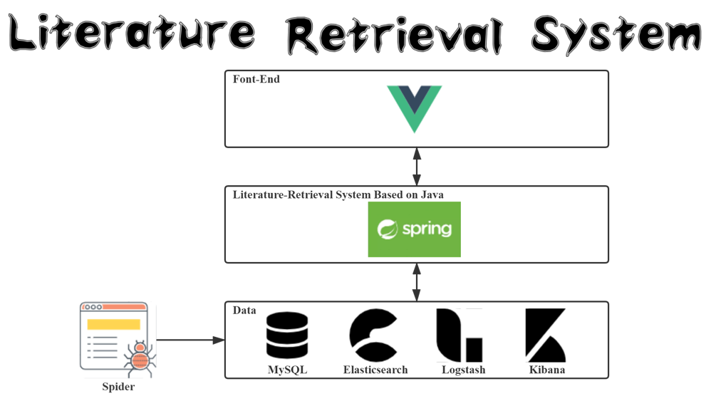
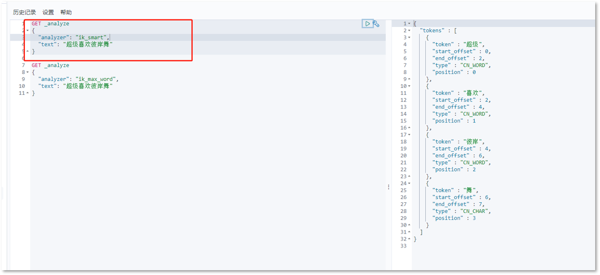
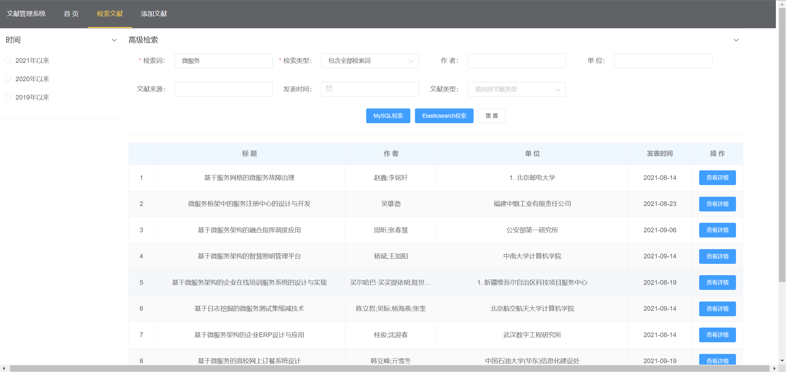

<div align="center">
    
</div>


---

本项目为一个简单的文献检索系统——更多是为了了解并应用Elasticsearch、Logstash与Kibana。

[本项目前端地址](https://github.com/Mahongsheng/literature-retrieval-front)

## 文献哪里来？

GitHub找到了一个知网爬虫，但是已经不能使用了，于是乎自己魔改了一番；

[爬虫地址](https://github.com/Mahongsheng/cnki-download)

一共爬了接近1万条数据；

## 架构

所有文献数据先是存储在MySQL中，然后经由LogStash同步MySQL，将数据全量且增量的拷贝到Elasticsearch中，Kibana作为ES的可视化工具使用；



## 用例图


> 注意：在查询文献分为MySQL查询和ES查询，其中MySQL查询中使用**Ansj**分词器，ES中使用**IK Analyzer**分词器：



## LogStash配置文件

```java
input {
    stdin{
    }
    jdbc {
      # 连接的数据库地址和数据库，指定编码格式，禁用SSL协议，设定自动重连
      jdbc_connection_string => "jdbc:mysql://127.0.0.1:3306/literature_retrieval?characterEncoding=UTF-8&useSSL=false&autoReconnect=true"
      # 用户名密码
      jdbc_user => "root"
      jdbc_password => "mydatabase"
      # jar包的位置
      jdbc_driver_library => "D:\ELK\logstash-7.15.0\mysql-connector-java-8.0.26.jar"
      # mysql的Driver
      jdbc_driver_class => "com.mysql.cj.jdbc.Driver"
      jdbc_default_timezone => "Asia/Shanghai"
      jdbc_paging_enabled => "true"
      jdbc_page_size => "10"
      #statement_filepath => "config-mysql/test.sql"
      #注意这个sql不能出现type，这是es的保留字段
      statement => "select * from literature"
      schedule => "* * * * *"
    }
}
output {
    elasticsearch {
        hosts => "127.0.0.1:9200"
        # index名
        index => "literature"
        # type名
        document_type => "_doc"
        # 需要关联的数据库中有有一个id字段，对应索引的id号
        document_id => "%{id}"
    }
    stdout {
        codec => json_lines
    }
}
```

## 看看运行效果

首页检索：


MySQL检索：


ES检索：



添加文献：


> 请注意！批量添加文献，excel或csv的格式必须如本项目的`document/Reference_detail.xls`中一样，即列名列数；

Over，祝好！

如有用烦请Star一下下，需要项目PPT请发邮件到`mahhss@foxmail.com`，由于本人总是意念回复，如回复的慢了请海涵一下下~
